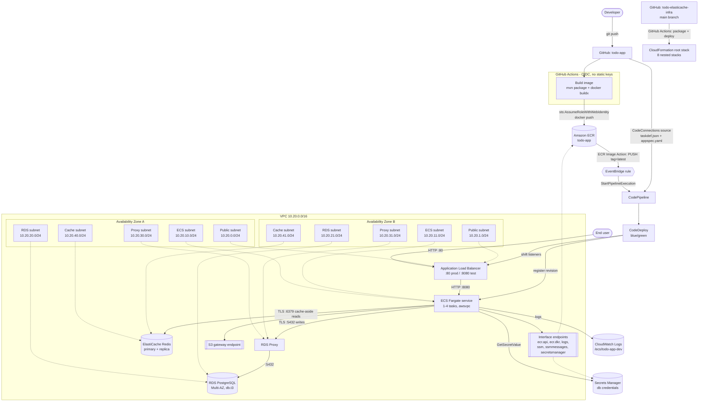

# Architecture

Single Region (`eu-west-1`), two Availability Zones, one custom VPC
(`10.20.0.0/16`) with five dedicated subnet tiers per AZ.

## Network diagram

## Request path

1. A browser hits the ALB on port 80. The ALB is the only internet-facing
   component; its security group allows 80 in from the internet and 8080 out to
   the ECS security group, nothing else.
2. The ALB forwards to a Fargate task in a private ECS subnet. Tasks have
   `AssignPublicIp: DISABLED` and no NAT gateway.
3. `GET /api/tasks` first asks Redis (`todo:tasks:all`). On a hit the response is
   returned straight from cache; on a miss the task reads PostgreSQL through the
   RDS Proxy and repopulates the key with a 60 second TTL.
4. Every write (`POST`/`PUT`/`DELETE`) goes to PostgreSQL through the proxy and
   then invalidates the affected cache keys, so the next read re-warms them.

## Why there is no NAT gateway

The only outbound calls a task makes are to ECR (image pull), CloudWatch Logs,
SSM Parameter Store, Secrets Manager and S3 (ECR layers). All six are reachable
over VPC endpoints, so the private subnets carry no default route at all. That
removes roughly $65/month of NAT charges per AZ and removes internet egress as
an exfiltration path.

## Security group matrix

| Group | Ingress | Egress |
| --- | --- | --- |
| `alb-sg` | :80 from `AllowedHttpCidr`, :8080 from `TestListenerCidr` | :8080 to `ecs-sg` |
| `ecs-sg` | :8080 from `alb-sg` | :5432 to `rdsproxy-sg`, :6379 to `cache-sg`, :443 to `vpce-sg`, :443 to S3 prefix list |
| `rdsproxy-sg` | :5432 from `ecs-sg` | :5432 to `rds-sg` |
| `rds-sg` | :5432 from `rdsproxy-sg` | none (pinned to 127.0.0.1/32) |
| `cache-sg` | :6379 from `ecs-sg` | none (pinned to 127.0.0.1/32) |
| `vpce-sg` | :443 from `ecs-sg` | none (pinned to 127.0.0.1/32) |

Leaving `SecurityGroupEgress` out of a CloudFormation security group silently
creates an allow-all `0.0.0.0/0` rule, so every group here declares egress
explicitly and the three that never initiate connections are pinned to
`127.0.0.1/32`.

## Deployment flow

| Step | Component | Detail |
| --- | --- | --- |
| 1 | GitHub Actions (`todo-app`) | Builds the image, assumes an IAM role via OIDC, pushes `:<sha>` then `:latest` to ECR |
| 2 | EventBridge | Rule matches `ECR Image Action` / `PUSH` / `SUCCESS` / `image-tag: latest` |
| 3 | CodePipeline | Source stage pulls `taskdef.json` + `appspec.yaml` from the app repo and `imageDetail.json` from ECR |
| 4 | CodeDeploy | Registers a new task definition revision (`<IMAGE1_NAME>` replaced), starts the green task set behind the :8080 test listener |
| 5 | CodeDeploy | Shifts the :80 production listener to green, keeps blue for 5 minutes, then terminates it |
| 6 | CloudWatch alarms | 5xx or unhealthy-host alarms roll the deployment back automatically |

## Diagrams

`docs/architecture.drawio.xml` is the reference diagram: standard AWS
Architecture Icons, AWS Cloud / Region / VPC / Availability Zone grouping, all
five subnet tiers with their real CIDRs, and the release path numbered 1-4.
Open it at <https://app.diagrams.net> (File -> Open From -> Device) or with the
draw.io extension in VS Code or JetBrains. Export to PNG or SVG from
File -> Export as.
